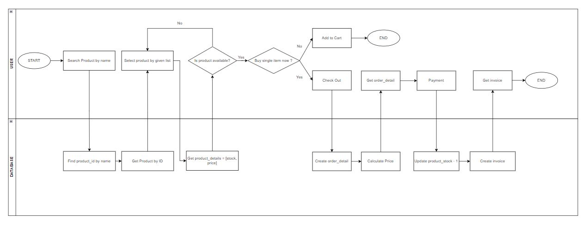

# Week 6 E-Commerce Design by Anggih Pratama

This project is containing System Design, Algorithm Design, and Complexity Analysis as requested on Week-6 Full Stack Software Engineer Madrid Revou 2023

## System Design



## Algorithm Design

```
START
1. User search for product by name.
2. Database collect all product_id which contain name given by user.
3. Send all product based on collected product_id on step 2.
4. User select product by given list.
5. Database find product_details based on selected product on step 4.
6. If product is not available:
	7. Then, back to step 4.
   Else:
	7. Asking user to buy single item now.
8. If user doesn't want to buy now.
	9. User add product to Cart.
	END
   Else:
	9. User get product to Check Out page.
10. Database create order_detail.
11. Database calculate the Price.
    total_price = product_price * 1
12. User get detailed product order to buy.
13. User proceed to payment process of the product.
14. Database update stock product
    product_stock = product_stock - 1
15. Database create invoice of the transaction.
16. User get the invoice transaction.
END
```

## Complexity Analysis

Since no matter how many times user get items with no stock available, database is only query for get product by id once, it means O(log n). Then the complexity of create order_detail is O(1) and user only update product_stock once when user had completed payment, it means O(log n). So the complexity of this design is O((log n)^2).
